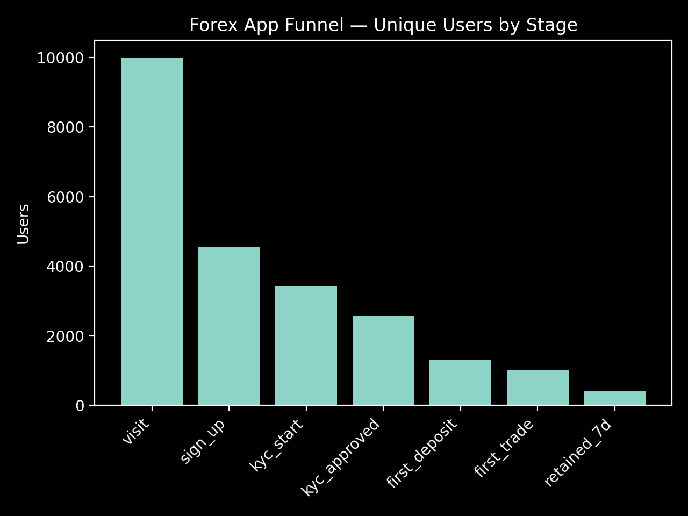
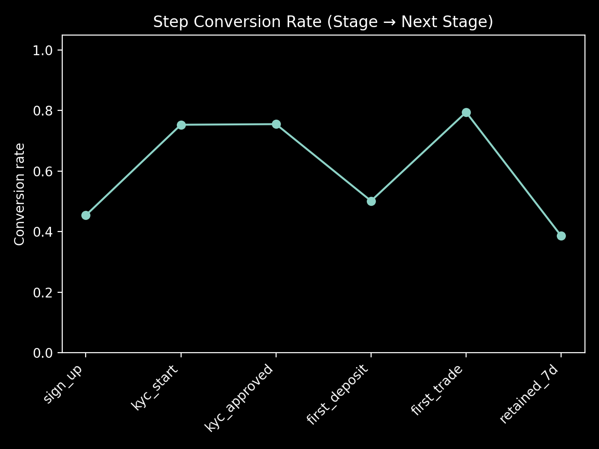
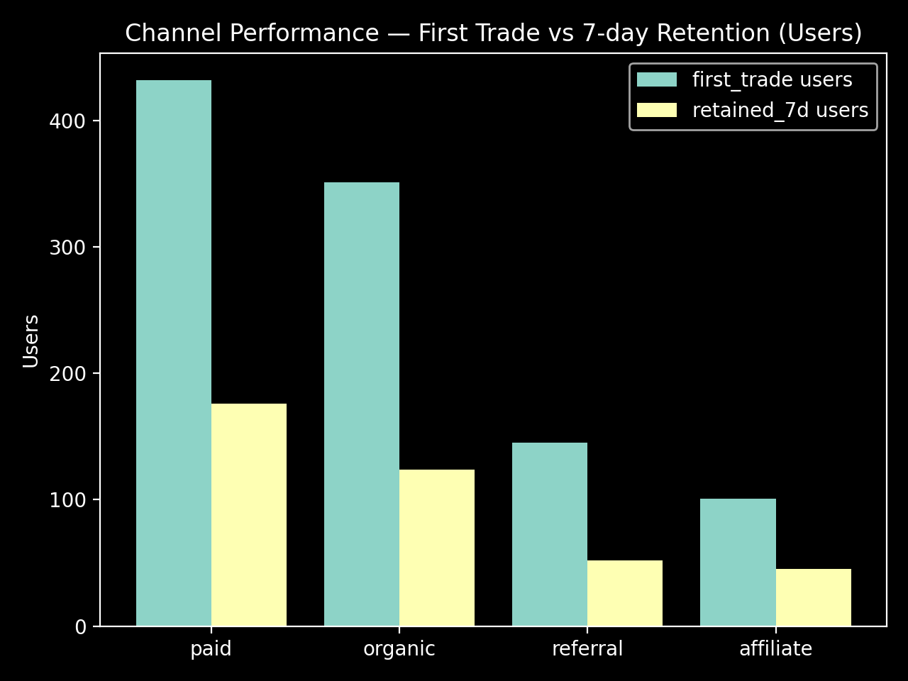

# Forex Trading App Funnel & Conversion Analysis (Python + SQL)

This project simulates event-tracking data for a Forex trading app and analyzes the onboarding funnel using SQLite (SQL) and Python (pandas).

For a deeper discussion of funnel bottlenecks, channel quality, and product recommendations, see [Analysis.md](Analysis.md).

## Funnel Stages
visit -> sign_up -> kyc_start -> kyc_approved -> first_deposit -> first_trade -> retained_7d

## Key Results (From SQL)

- visit: 10000
- sign_up: 4539
- kyc_start: 3419
- kyc_approved: 2582
- first_deposit: 1295
- first_trade: 1029
- retained_7d: 397

### Funnel Users by Stage


### Step Conversion Rates


### Channel Performance: First Trade vs Retention


## How to Run
1. Install Dependencies:
   ```bash
   pip install -r requirments.txt
   
2. Generate the Dataset:
   ```bash
   py src\data_generation.py
   
3. Load Data into SQLite
   ```bash
   py src\load_to_sqlite.py
   
4. Run the Analysis Notebook:
   - Open "notebooks/01_funnel_analysis.ipynb"
   - Run all cells